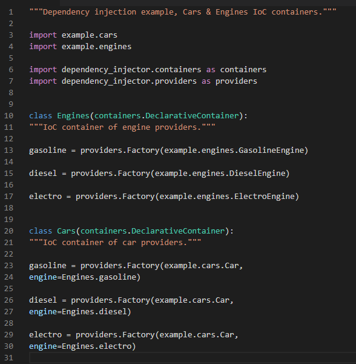

# Inyección de Dependencias

## 1. ¿Qué es inyección de dependencias?

## 2. Inyección de dependencias en python

### 2.1. Paquete dependency-injector PyPI

<<<<<<< HEAD
Para aplicar DI en python usamos la librería [dependency-injector](https://pypi.org/project/dependency-injector/).

La inyección de dependencia, como patrón de diseño de software, tiene varias ventajas que son comunes para cada lenguaje (incluido Python): 

-	La inyección de dependencia se puede utilizar para externalizar los detalles de configuración de un sistema en archivos de configuración que permiten reconfigurar el sistema sin recompilarlo. Se pueden escribir configuraciones separadas para diferentes situaciones que requieren diferentes implementaciones de componentes. Reducción del código repetitivo en los objetos de la aplicación ya que todo el trabajo para inicializar o configurar dependencias es manejado por un componente proveedor.
-	La inyección de dependencia le permite al código cliente eliminar todo conocimiento de una implementación concreta que necesita usar. Esto ayuda a aislar al cliente del impacto de los cambios y defectos de diseño. Promueve la reutilización, la capacidad de prueba y la mantenibilidad.
-	 La inyección de dependencia le permite al código cliente la flexibilidad de ser configurable. Solo el comportamiento del cliente es fijo. El cliente puede actuar sobre cualquier cosa que admita la interfaz intrínseca que el cliente espera.




DI utiliza providers y containers para realizar la inversión de dependencia:

- __Providers__ : Crea una nueva instancia de la clase especificada en cada llamado.


- __IoC Containers__: Los contenedores son colecciones de proveedores. El propósito principal de los contenedores es agrupar proveedores.


=======
>>>>>>> master
## 3. ¿Cómo aplicamos al juego Space Invaders?

### 3.1. Componentes del juego


### 3.2. Donde realizamos las inyecciones
La inyección de dependencias la realizamos en dos ocaciones: 
- Al momento en que se debe declarar el objeto PLAYER, que vendria a ser la nave que representa al jugador. En este caso esta nave puede tener tres modos de combate: fuego,hielo y veneno. Cada uno de estos modos tiene asociada una clase distinta y para suministrar los objetos de dichas clases existe un contenedor (en el archivo containers.py) preparado para proporcionarlos.
- Al momento de definir a los enemigos. Hay tres clases para cada tipo de enemigo (fuego, hielo, veneno) y sus objetos correspondientes son proveidos por el contenedor previamente mencionado.

## 4. ¿Cómo reproducir el juego?

### 4.1. Instalación

El juego requiere de los siguientes paquetes:
- dependency-injector
- pygame

Abrir su shell y realizar las siguientes comandos 
```sh
$ pip install dependency-inyector 
$ pip install pygame
```

### 4.2. Ejecución

1. Descargar el paquete
2. Ubicarse en el paquete
3. Abrir una shell 
4. Realizar el siguiente comando:
```sh
$ python main.py 
```

Nota: 
Verificar en su entorno de variables la palabra clave para ejecutar python, python3 o python

## 5. Demo 
Imagenes

Video de la demostración en el siguiente enlace: [demo](url)

